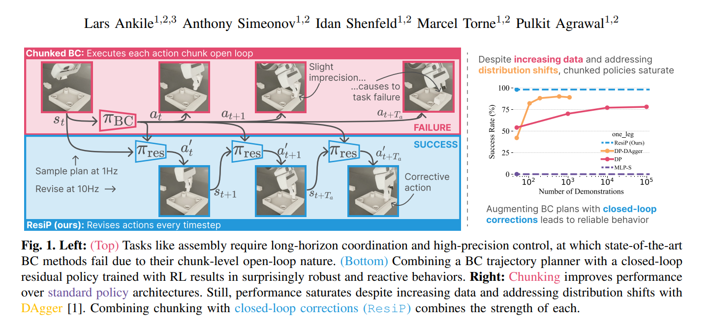
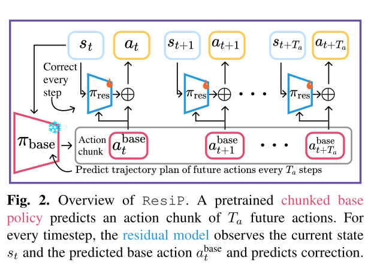
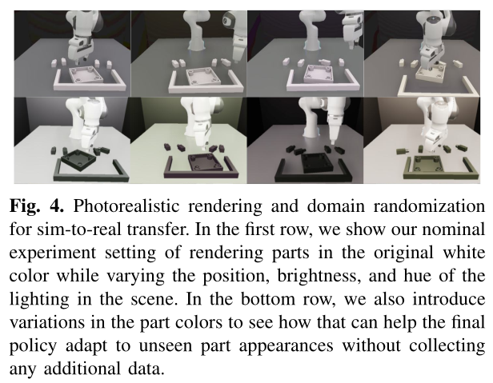
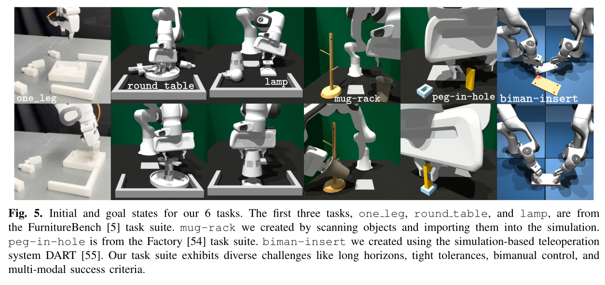
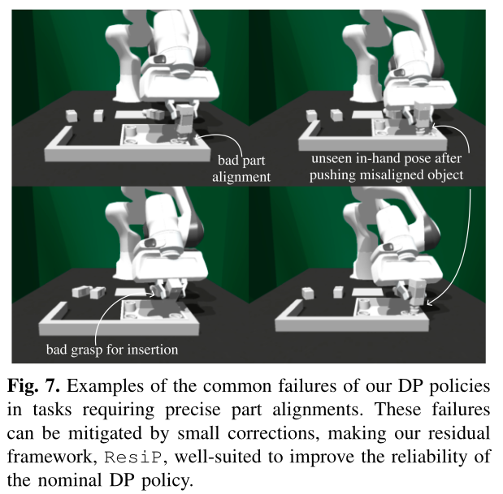
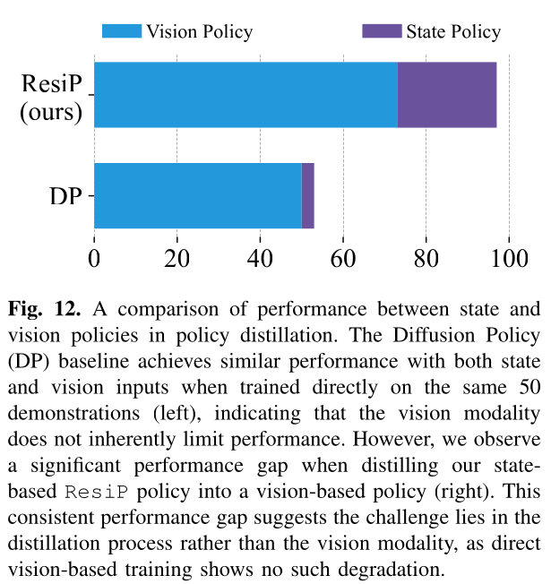

# From Imitation to Refinement – Residual RL for Precise Assembly


## Abstract

Behavioural Cloning (BC) have quite effective in teaching robots.
The performance saturation can be attributed to two critical
factors:   
(a) distribution shift resulting from the use of offline
data and   
(b) the lack of closed-loop corrective control caused
by action chucking (predicting a set of future actions executed
open-loop) critical for BC performance

Hypothesis:    
``` Use BC as a trajectory "plannners" and augment it with a fully closed-loop residual policy trained with reinforcement learning (RL) that addresses distribution shifts and introduces closed-loop corrections over open-loop execution of action chunks predicted by the BC trajectory planner ```



# I. INTRODUCTION


## Reason for performance Saturation from BC methodds

Hypothesis:  
i) compounding errors originating from distribution shift as the policy operates on states that increasingly deviate from those seen during training
ii) compounding errors originating from distribution shift as the policy operates on states that increasingly deviate from those seen during training


# Improvement [selling point]

  ```RL is a standard to BC's issues. However, recent advancements in BC architectures present new challenges for direct RL fine-tuning.```

    The main issues are that the structure of diffusion models (iterative refinement) and action-chunked policies (resulting in a large action space) make standard RL algorithms unstable

Check Sec. IV-A


**Alternative to RL** :  
One can overcome distribution shift by leveraging an expert and 
training with supervised learning such as the ```Dataset Aggregation (DAgger) [1] algorithm```.





# II. METHOD

Our approach from task definition to ```deployable vision policy``` consists of three key components

1.  First, we train a base policy using behavior cloning (BC) on a small set of demonstrations (Sec. II-B) in simulation.
2. Then, we improve this policy’s precision by
training a ```residual component``` with reinforcement learning
that makes closed-loop corrections to the base policy’s
actions (Sec. II-C).
3. Finally, we learn a real-world deployable
policy with ```policy distillation and co-training``` with a few real-
world demonstrations (Sec. II-D).


## A. Problem Formulation


## B. Base Policy Learning via Behavior Cloning

We use Dsim to first train base policy πbase with Behavior Cloning (BC), i.e., πbase = argmaxπbase E(at ,st )∼Dsim [log πbase (at |st )

we use action chunks that predict a set of multiple future actions instead of a single
action at every timestep.

we only execute a subset base [abase t , ..., at+Texec ], with execution horizon $T_{exec} ≤ T_a$

## C. Reactive Control via ResiP

Given the initial chunked base policy πbase obtained by BC described above, we want to improve the policy to overcome the issues of distribution shift and the lack of reactivity.


One way to mitigate the adverse effects of distribution
shifts is to fine-tune the BC-trained policy with RL

But used: a residual [42]–[49] Gaussian Multi-Layer
Perceptron (MLP) [51] policy πres using PPO [52]


we form the residual’s observation by
concatenating the full simulation state (robot proprioceptive
information and object poses) with the base policy’s pre-base dicted action, sres
t + i]. The residual policy t+i = [st+i , a_res then produces a corrective action ares t+i ∼ πres (·|st+i ) that res modifies the base action: at+i = abase + a.

The resulting t+i t+i fine-tuned policy is a combination of the pre-trained BC policy πbase and the correction policy πres , denoted π

The policy observation for simulation training, S contains
the 6 DoF end-effector pose T, spatial velocity V, and
gripper width wg , along with the 6-DoF poses of all the
num parts . parts in the environment {Tparti }i=1

## D. Sim-to-Real Transfer


We treat πres trained in simulation using privileged state
information, S, as a teacher policy πteacher to distill into a
student policy πstudent that takes as input sensory observations and can therefore be deployed in the real world. 

The real world observation space O contains the robot end-
effector pose T ∈ SE(3), robot end-effector spatial velocity
V ∈ R6 , the gripper width wg , and RGB images from a fixed
front-view camera (I front ∈ Rh×w×3 ) and a wrist-mounted
camera (I wrist ∈ Rh×w×3 ), each with uncalibrated camera
poses.


To bridge the sim-to-real gap, we convert the trajectory dataset with only state
information (S) into trajectories with sensory observations
(O) by re-rendering the trajectories into realistic-looking
image observations (see Fig. 4 for examples)




$ \pi_{student}$ is represented with a Diffusion Policy architecture that uses ResNet18 [59] vision encoder pre-trained on robotic manipulation data

The real demonstrations contain only RGB observations and no ground-truth pose information.

# III. EXPERIMENTAL SETUP

## A. Tasks and Environment



    Can we also use Mujoco sim to run a task(biman-insert) ?

The biman-insert task is implemented using the MuJoCo simulator [62], with the demos provided using the DART teleoperation system from [55]


## B. System Configuration

The policy operates at 10Hz on a 7 Degrees-of-Freedom (DoF) Franka Emika Panda robot arm for all tasks but biman-insert, which operates at 50Hz on two Franka
Panda arms (i.e., 14 DoF).
    Why 50Hz is feasible for biman-insert? Is it because of Mujoco sim ?

The action space consists of
the desired end-effector pose Tdes ∈ SE(3) (i.e., both
position and orientation) and a binary gripper command for
opening/closing the parallel-jaw gripper.


These desired end-effector poses are converted to joint position targets using differential inverse kinematics [63], then tracked using a low-level PD controller running at 1KHz with manually specified stiffness and dampening parameters lightly tuned to balance compliance with accurate trajectory tracking.

## C. Evaluation protocol

1. **Primary Evaluation**:
2. **Robustness to Dynamic Disturbances**: 
3. **Real-World Evaluation Protocol** :  we use IsaacSim [64] to render photorealistic trajectories of our simulation data, as it provides better rendering capabilities than IsaacGym [61].

## D. Baselines and Ablations

1. **Behavior Cloning Baselines**

We find the Diffusion Policy architecture [19] provides the strongest BC performance and use it as both our primary baseline and the foundation for ResiP.

2. **Distribution Shift Analysis**

The DAgger policy is trained with the same BC loss and architecture as the nominal
DP policy.

3. **Reinforcement Learning Comparisons**

    1. First, we evaluate PPO fine-tuning of our chunked MLP policy (PPO-C) [52], treating each action chunk as a single concatenated action.

    2. For our diffusion-based policy, we implement IDQL [65], where multiple action chunks are sampled from the diffusion policy and selected based on learned Q-values using the on-policy method of [66].


4. **Closed-Loop Control Ablation**

    ResiP-C observes the current state and all actions in the predicted chunk and predicts a correction of all actions in the chunk. ResiP-C uses the same online PPO training procedure as ResiP.


5. **Real-World Baselines**

We compare the real-world performance of two policies:

1. **Real-Only** : 
Diffusion policies trained exclusively on real-world demonstrations Dreal , using
either 10 or 40 demonstrations, e.g., denoted 10 Real-Only.

2. **Real+Sim:**: Following our sim-to-real approach described in Sec. II-D, we combine the same real-world demonstrations with our synthetic rendered dataset, e.g., denoted 10 Real+Sim


# IV. EXPERIMENTAL RESULTS

Our experimental evaluation focuses on three key aspects.

1. First, we analyze how augmenting chunked Behavior Cloning (BC) policy with closed-loop residual Reinforcement Learning (RL) enables reliable execution of precision-critical manipulation tasks

2. (Is ResiP really crucial ?) Second, through ablation studies, we identify design choices crucial for ResiP’s performance gains

3. Finally, we evaluate our method on physical robot hardware (Sec. IV-C), demonstrating  improved real-world performance through teacher-student distillation while analyzing distillation bottlenecks.

## A. Augmenting Trajectory Planning with Reactive Control

1. **Analyzing Failure Modes**:

Why Diffusion Policies fails? : 

        In the low randomization setting, we observe that
        DP’s failures primarily arise from small imprecisions: a com-
        mon error is pushing the leg down before achieving perfect
        alignment with the hole. Consequently, the object’s pose
        shifts slightly in the gripper, causing an out-of-distribution
        grasp pose.




## B. What drives performance of ResiP?

This section investigates different aspects of ResiP that
improve task performance:

1. training stability and sample efficiency across RL methods
2. the impact of addressing distribution shift through online data collection,
3. the benefits of closed-loop control compared to chunk-based execution
4. robustness to dynamic perturbations


1. **Performance and Training Characteristics of RL Methods:**

In contrast, ResiP demonstrates stable training behavior.
Its architecture naturally constrains corrections to be local ad-
justments to the base policy’s absolute pose predictions rather
than operating in the full workspace coordinate frame

2. **Impact of Distribution Shift**

While DP-DAgger significantly outperforms the baseline DP (see yellow vs. red it still trails ResiP (blue line) by 9% and 23% for the one leg and round table tasks, respectively.

        The remaining performance gap suggests that reducing distribution shift with online data collection does not fully explain ResiP’s performance benefits


3. **Impact of Closed-Loop Control**

4. **Robustness to Dynamic Perturbations:**


## C. Real-World Deployment


1. **Real-World Performance**
To assess robustness to visual variations, we tested changing part colors from the white used in data collection to an unseen black.

2. **Understanding Performance Limitations**

    To understand the gap between simulation and real-world performance, we hypothesize three potential limiting factors:

    1. the change from state- to vision-based observations,
    2. the sim-to-real gap,
    3. the policy distillation process.



Indicating a fundamental limitation in the policy distillation process itself rather than purely sim-to-real challenges.


# V. RELATED WORKS

## A. Training diffusion models with reinforcement learning

A fundamental challenge in applying RL to diffusion
models is that the final action probabilities are not directly
accessible due to the iterative nature of the denoising process,
making policy gradient methods difficult to apply

Some approaches cast diffusion de-noising as a Markov Decision Process [40,74], enabling preference-aligned image generation with policy
gradient RL, but suffer from training instability.

While [41] introduced more stable direct diffusion policy fine-tuning,
their method remains architecture-specific and lacks closed-
loop control.

While this improves BC performance, it creates
significant challenges for RL fine-tuning by expanding the
action space—for instance, chunks of 8 actions result in an 8-
fold increase in action dimensionality.

Policy gradient methods struggle with such high-dimensional action spaces

Our method avoids these problems by keeping the base policy frozen
and training only a small residual model, which preserves
the pre-trained capabilities and enables stable policy gradient
training with closed-loop control.


## B. Residual learning in robotics

# VI. DISCUSSION

    Our imitation learning scaling analyses were conducted using a dataset from an RL expert, not human demonstrations.


